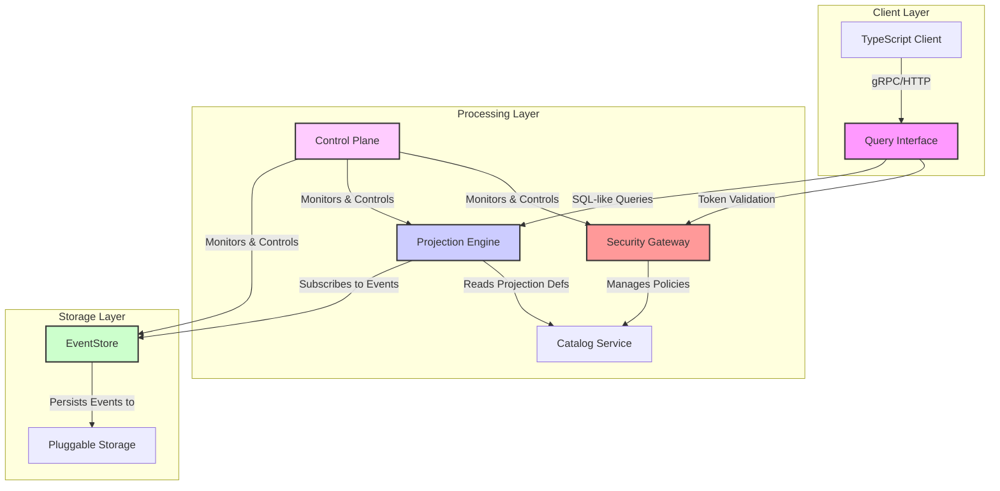

# ActorDB - Dekigoto


*Logo illustration by [irasutoya](https://www.irasutoya.com/2015/08/blog-post_33.html)*

[](https://doi.org/10.5281/zenodo.17224266)

**ActorDB** is a novel database model that combines **single-writer actor serialization**, **incremental view maintenance (IVM)**, and **zero-trust messaging** into a unified database experience.

## Overview

ActorDB provides:
- **Write Model**: Actor (aggregate) based event persistence with append-only semantics
- **Read Model**: Query-driven projections with on-demand computation and automatic materialization promotion
- **Security**: mTLS + JWS signatures + ABAC/RBAC with RLS/column masking built into projections
- **Consistency**: Strong single-writer serialization within actors, eventual consistency across actors with sagas

## Architecture



*Requires separate build with tags
**SQLite-compatible with remote capabilities

## Core Components

### EventStore
- Actor-based single-writer append-only event storage
- **Multi-backend storage support**:
  - **Memory**: In-memory storage for testing/development
  - **SQLite**: Embedded database for single-node deployments
  - **PostgreSQL**: Production-grade RDBMS with advanced features
  - **libSQL**: SQLite-compatible with remote capabilities ([turso.tech/libsql](https://turso.tech/libsql))
  - **RocksDB**: High-performance KV store (requires `go build -tags rocksdb`)
  - **LevelDB**: Alternative KV store (requires `go build -tags leveldb`)
- Snapshot management with configurable retention
- Compression (Protobuf/Parquet) and indexing

### Projection Engine
- Incremental View Maintenance (IVM) with automatic promotion/demotion
- Late event handling with watermarks and correction windows
- Priority queuing for interactive vs batch workloads

### Security Layer
- **Zero-Trust Architecture**: mTLS with client certificate authentication
- **Token-based Authentication**: JWS (JSON Web Signature) with HMAC-SHA256
- **Role-Based Access Control (RBAC)**: Configurable policies for resource authorization
- **Row-Level Security (RLS)**: Tenant-based data isolation and column masking
- **Comprehensive Audit Logging**: All security events and operations tracked

#### Security Features

##### Authentication
- **Mutual TLS (mTLS)**: Client and server certificate validation
- **JWS Token Verification**: Signature validation, expiration checks, issuer validation
- **Multi-layer Defense**: Network-level (TLS) + Application-level (JWS) authentication

##### Authorization
- **RBAC Policies**: Role-to-permission mapping with configurable policies
- **Protected Endpoints**: HTTP middleware for automatic permission checks
- **Fine-grained Access Control**: Resource-specific permission validation

##### Security Testing Results ✅
- **Static Analysis**: gosec scans pass with no high-severity vulnerabilities
- **Dependency Scanning**: govulncheck confirms no known vulnerabilities
- **Dynamic Testing**: mTLS authentication, JWS validation, RBAC authorization verified
- **Configuration Review**: Secure defaults implemented for production deployment

### Query Interface
- SQL-like declarative query language
- Transparent RLS integration
- Support for temporal queries with event-time semantics

### Control Plane
- Auto-scaling and shard rebalancing
- Health monitoring and SLO tracking
- Certificate rotation and policy distribution

## Process Network Model

This project follows a **Merkle DAG-based process network model** defined in `dag.jsonnet`. All operations must maintain topological consistency:

- **Execution**: Follow topological sort order
- **Problem Resolution**: Use reverse topological sort to identify root causes
- **Dependencies**: Keep dependency DAG minimal and stable

## Quick Start

```bash
# Build Go implementation (default variant)
./build.sh go

# Run with example configuration
./bin/go/actordb-default --config config/example.yaml
```

## Implementations

This project contains two implementations of ActorDB:

- **`impl/go`**: The original implementation in Go.
- **`impl/rust`**: A newer, performance-focused implementation in Rust.

Both implementations share the same configuration files (`config/`), client libraries (`client/`), and process model (`dag.jsonnet`).

## Building ActorDB

Use the `build.sh` script to build the desired implementation.

### Building the Go Implementation

The Go implementation supports multiple storage backends.

```bash
# Build all Go variants
./build.sh go --all

# Build a specific storage backend (e.g., rocksdb)
./build.sh go --rocksdb

# The built binaries will be in ./bin/go/
./bin/go/actordb-rocksdb --config config/example.yaml
```

**Manual Go Build:**

To build manually, navigate to the Go directory:
```bash
cd impl/go

# Build libSQL variant
go build -o ../../bin/go/actordb-libsql ./cmd/actordb

# Build RocksDB variant
CGO_CFLAGS="-I/opt/homebrew/include" CGO_LDFLAGS="-L/opt/homebrew/lib -lrocksdb -lz -lbz2 -lsnappy -llz4 -lzstd" \
go build -tags rocksdb -o ../../bin/go/actordb-rocksdb ./cmd/actordb

cd ../..
```

### Building the Rust Implementation

```bash
# Build the Rust implementation
./build.sh rust

# The built binary will be in ./bin/rust/
./bin/rust/actordb --config config/example.yaml
```

**Manual Rust Build:**
```bash
cd impl/rust
cargo build --release
cp target/release/dekigoto ../../bin/rust/actordb
cd ../..
```


## Security Testing (Go)

ActorDB includes comprehensive security testing capabilities for the Go implementation:

#### Automated Security Scans

```bash
# Static Application Security Testing (SAST)
go install github.com/securego/gosec/v2/cmd/gosec@latest
gosec -fmt=json -out=security-scan.json ./...

# Dependency vulnerability scanning
go install golang.org/x/vuln/cmd/govulncheck@latest
govulncheck ./...
```

#### Manual Security Testing

**Generate test certificates:**
```bash
mkdir -p certs
openssl req -x509 -nodes -newkey rsa:2048 -keyout certs/server.key -out certs/server.crt -subj "/CN=localhost"
openssl genpkey -algorithm RSA -out certs/client.key
openssl req -new -key certs/client.key -out certs/client.csr -subj "/CN=test-client"
openssl x509 -req -in certs/client.csr -CA certs/server.crt -CAkey certs/server.key -CAcreateserial -out certs/client.crt -days 365
```

**Test authentication and authorization:**
```bash
# Generate tokens with different roles
ADMIN_TOKEN=$(./actordb --generate-token)
USER_TOKEN=$(TOKEN_ROLES=admin ./actordb --generate-token)

# Test admin access (should succeed)
curl -k --key certs/client.key --cert certs/client.crt \
  -H "Authorization: Bearer $USER_TOKEN" \
  http://localhost:9090/query/admin

# Test user access to admin endpoint (should fail with 403)
curl -k --key certs/client.key --cert certs/client.crt \
  -H "Authorization: Bearer $ADMIN_TOKEN" \
  http://localhost:9090/query/admin
```

#### Security Test Results

✅ **Static Analysis**: No high-severity vulnerabilities detected
✅ **Dependency Scanning**: All dependencies verified secure
✅ **Authentication Testing**: mTLS + JWS validation working correctly
✅ **Authorization Testing**: RBAC policies enforcing access control
✅ **Configuration Review**: Secure defaults implemented

## Configuration

See `config/example.yaml` for configuration options.

### Security Configuration

Configure security settings in `config/example.yaml`:

```yaml
security:
  mtls_enabled: true                    # Enable mutual TLS authentication
  jwt_issuer: "https://actordb.example.com"  # JWT issuer for token validation
  jwt_lifetime_sec: 300                 # Token lifetime in seconds
  jws_secret: "your-very-secret-and-long-key-for-hs256"  # HMAC secret for JWS
  audit_stream_enabled: true            # Enable audit logging
  spiffe_trust_domain: "example.org"    # SPIFFE trust domain
```

#### Security Best Practices

**Production Deployment:**
- Use strong, randomly generated JWS secrets (256+ bits)
- Configure proper TLS certificates from trusted CAs
- Enable audit logging and monitor security events
- Use short-lived tokens (≤5 minutes) with refresh mechanisms
- Implement proper certificate rotation policies
- Configure RBAC policies based on least privilege principle

**Network Security:**
- Use TLS 1.2 or higher for all connections
- Enable client certificate authentication
- Configure firewall rules to restrict access
- Use secure certificate management (cert-manager, etc.)

### Storage Configuration

Configure your preferred storage backend in `config/example.yaml`:

```yaml
eventstore:
  storage:
    type: "libsql"  # memory, sqlite, postgresql, libsql, rocksdb, leveldb
    path: "/data/actordb/events.db"  # For SQLite/RocksDB/LevelDB
    connection_string: "libsql://your-database.turso.io"  # For libSQL/PostgreSQL remote
    options:
      max_connections: 25  # Additional options
```

## TypeScript Client

ActorDB provides a full-featured TypeScript client library for easy integration:

### Installation

```bash
cd client/typescript
npm install
npm run build
```

### Usage

```typescript
import { quickStart } from './dist';

// Quick setup
const { client, actors, queries } = quickStart('http://localhost:9090', 'your-token');

// Work with actors
const user = actors.getActor('user-123', 'user');
await user.create();
await user.writeEvent('user_created', { name: 'John', email: 'john@example.com' });

// Query data
const result = await queries.projectionState('user_profiles').execute();
console.log(result.data);
```

See `client/typescript/README.md` for detailed documentation.

## C Library Dependencies (for Go build)

For RocksDB and LevelDB storage backends in the Go implementation, you need to install the corresponding C libraries:

### macOS (Homebrew)

```bash
brew install rocksdb leveldb
```

### Ubuntu/Debian

```bash
sudo apt-get install librocksdb-dev libleveldb-dev
```

### CentOS/RHEL

```bash
sudo yum install rocksdb-devel leveldb-devel
```

## MVP Validation Criteria

### Performance Metrics
- **Actor Throughput**: ≥50-100k cmds/sec/node
- **Projection Latency P99**: ≤200ms (ondemand), ≤50ms (materialized)
- **Late Event Correction**: Failure rate < 10^-6
- **Rebuild Time**: ≤30s for 100GB projections

### Security Metrics
- **Authentication Latency**: ≤10ms for token validation
- **Authorization Latency**: ≤5ms for permission checks
- **Security Propagation**: ≤30s for key revocation
- **Audit Completeness**: 100% coverage of security events
- **Vulnerability Assessment**: Zero high-severity findings

## License

MIT License
