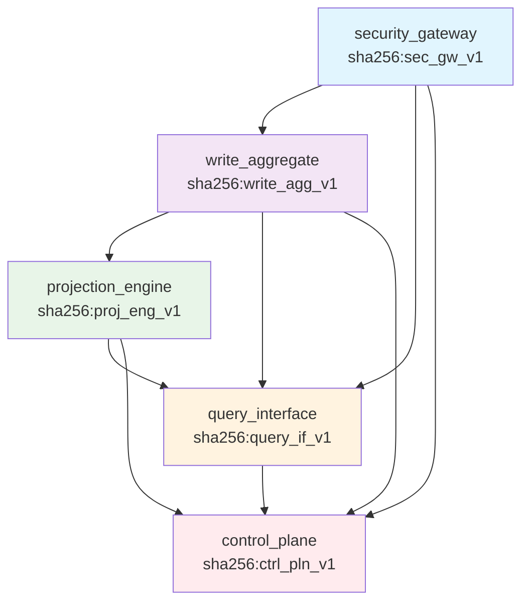

# Merkle DAG Structure

ActorDB TypeScript uses Merkle DAG (Directed Acyclic Graph) for immutable component versioning, dependency tracking, and system integrity. This approach ensures reproducible builds, reliable deployments, and traceable component relationships.

## What is a Merkle DAG?

A Merkle DAG combines:
- **Merkle Trees**: Cryptographic integrity through hash chaining
- **DAG Structure**: Directed acyclic graph for dependency relationships
- **Immutable Content**: Content-addressable storage prevents tampering

```json
{
  "id": "security_gateway",
  "description": "Zero-trust messaging with mTLS + JWS + ABAC/RBAC",
  "dependencies": [],
  "outputs": ["validated_tokens", "audit_stream"],
  "security": "spiffe_shortlived_jwt",
  "slo": "token_validation_10ms",
  "merkle_hash": "sha256:sec_gw_v1"
}
```

## Component Hashing

### SHA-256 Hash Generation

Each component includes a Merkle hash of its:
- Interface definition
- Implementation logic
- Configuration schema
- Test specifications
- Documentation

```typescript
// Component hash calculation
function calculateComponentHash(component: ComponentDefinition): string {
  const content = {
    id: component.id,
    interfaces: component.interfaces,
    implementation: component.implementation,
    config: component.configSchema,
    tests: component.testCases,
    docs: component.documentation
  };

  const serialized = JSON.stringify(content, Object.keys(content).sort());
  return `sha256:${crypto.createHash('sha256').update(serialized).digest('hex')}`;
}
```

### Version Control

Component versions are immutable:

```typescript
interface ComponentVersion {
  id: string;
  version: string;
  merkleHash: string;
  previousVersion?: string;
  timestamp: Date;
  author: string;
  changes: string[];
}

// Version chain for audit trail
const versionChain: ComponentVersion[] = [
  {
    id: 'security_gateway',
    version: 'v1.0.0',
    merkleHash: 'sha256:sec_gw_v1',
    timestamp: new Date('2024-01-01'),
    author: 'system',
    changes: ['Initial implementation']
  },
  {
    id: 'security_gateway',
    version: 'v1.1.0',
    merkleHash: 'sha256:sec_gw_v1_1',
    previousVersion: 'sha256:sec_gw_v1',
    timestamp: new Date('2024-02-01'),
    author: 'developer@example.com',
    changes: ['Added mTLS support', 'Improved JWT validation']
  }
];
```

## Dependency Resolution

### Topological Ordering

Dependencies form a DAG that must be resolved in topological order:

```typescript
class DependencyResolver {
  private components = new Map<string, ComponentDefinition>();
  private resolved = new Set<string>();
  private visiting = new Set<string>();

  resolve(componentId: string): string[] {
    if (this.resolved.has(componentId)) {
      return [];
    }

    if (this.visiting.has(componentId)) {
      throw new Error(`Circular dependency detected: ${componentId}`);
    }

    this.visiting.add(componentId);
    const component = this.components.get(componentId)!;
    const dependencies: string[] = [];

    for (const dep of component.dependencies) {
      dependencies.push(...this.resolve(dep));
    }

    this.visiting.delete(componentId);
    this.resolved.add(componentId);
    dependencies.push(componentId);

    return dependencies;
  }
}
```

### Integrity Verification

Verify component integrity before loading:

```typescript
class IntegrityVerifier {
  async verifyComponent(component: ComponentDefinition): Promise<boolean> {
    const calculatedHash = calculateComponentHash(component);
    const expectedHash = component.merkleHash;

    if (calculatedHash !== expectedHash) {
      throw new Error(
        `Component integrity check failed for ${component.id}. ` +
        `Expected: ${expectedHash}, Got: ${calculatedHash}`
      );
    }

    // Verify dependencies recursively
    for (const depId of component.dependencies) {
      const dep = await this.loadComponent(depId);
      await this.verifyComponent(dep);
    }

    return true;
  }
}
```

## Process Network DAG

### Full System Definition

```json
{
  "processes": {
    "security_gateway": {
      "id": "security_gateway",
      "description": "Zero-trust messaging with mTLS + JWS + ABAC/RBAC",
      "dependencies": [],
      "outputs": ["validated_tokens", "audit_stream"],
      "security": "spiffe_shortlived_jwt",
      "slo": "token_validation_10ms",
      "merkle_hash": "sha256:sec_gw_v1"
    },
    "write_aggregate": {
      "id": "write_aggregate",
      "description": "Single-writer actor event append",
      "dependencies": ["security_gateway"],
      "outputs": ["event_stream"],
      "security": "mtls_jws_validation",
      "slo": "p99_latency_100ms",
      "merkle_hash": "sha256:write_agg_v1"
    },
    "projection_engine": {
      "id": "projection_engine",
      "description": "Incremental view maintenance with auto-materialization",
      "dependencies": ["write_aggregate", "catalog_service"],
      "outputs": ["materialized_views", "ondemand_results"],
      "security": "rls_column_masking",
      "slo": "p99_latency_200ms_ondemand_50ms_materialized",
      "merkle_hash": "sha256:proj_eng_v1"
    },
    "query_interface": {
      "id": "query_interface",
      "description": "SQL dialect projection with declarative DSL",
      "dependencies": ["projection_engine", "catalog_service"],
      "outputs": ["query_results"],
      "security": "rls_transparent",
      "slo": "query_p99_100ms",
      "merkle_hash": "sha256:query_if_v1"
    },
    "control_plane": {
      "id": "control_plane",
      "description": "Auto-scaling, monitoring, and operational automation",
      "dependencies": ["query_interface", "projection_engine", "write_aggregate", "security_gateway"],
      "outputs": ["scaling_decisions", "health_metrics"],
      "security": "admin_only",
      "slo": "decision_latency_1s",
      "merkle_hash": "sha256:ctrl_pln_v1"
    }
  },
  "execution_order": [
    "security_gateway",
    "write_aggregate",
    "projection_engine",
    "query_interface",
    "control_plane"
  ],
  "version": "1.0.0",
  "merkle_root": "sha256:actordb_dag_v1_root"
}
```

### DAG Visualization



## Component Interfaces

### TypeScript Interface Definitions

```typescript
interface ComponentDefinition {
  id: string;
  description: string;
  version: string;
  merkleHash: string;
  dependencies: string[];
  interfaces: {
    inputs: InterfaceDefinition[];
    outputs: InterfaceDefinition[];
  };
  implementation: ImplementationDetails;
  configSchema: ConfigSchema;
  testCases: TestCase[];
  documentation: Documentation;
}

interface InterfaceDefinition {
  name: string;
  type: 'event' | 'data' | 'control';
  schema: any; // JSON Schema
  version: string;
}

interface ImplementationDetails {
  language: 'typescript';
  entryPoint: string;
  dependencies: string[];
  buildConfig: BuildConfig;
}
```

### Interface Compatibility

Components verify interface compatibility:

```typescript
class InterfaceVerifier {
  verifyCompatibility(
    consumer: InterfaceDefinition,
    provider: InterfaceDefinition
  ): boolean {
    // Check semantic versioning compatibility
    if (!this.isCompatibleVersion(consumer.version, provider.version)) {
      return false;
    }

    // Check schema compatibility
    if (!this.isCompatibleSchema(consumer.schema, provider.schema)) {
      return false;
    }

    return true;
  }

  private isCompatibleVersion(consumer: string, provider: string): boolean {
    const [cMajor, cMinor] = consumer.split('.').map(Number);
    const [pMajor, pMinor] = provider.split('.').map(Number);

    // Major version must match
    if (cMajor !== pMajor) return false;

    // Provider minor version must be >= consumer minor version
    return pMinor >= cMinor;
  }

  private isCompatibleSchema(consumer: any, provider: any): boolean {
    // JSON Schema compatibility checking
    // Simplified version - in practice use a proper JSON Schema library
    return this.deepEqual(consumer, provider);
  }
}
```

## Build System Integration

### Content-Addressable Storage

Components are stored by their Merkle hash:

```typescript
class ContentAddressableStorage {
  private objects = new Map<string, Buffer>();

  async store(content: Buffer): Promise<string> {
    const hash = crypto.createHash('sha256').update(content).digest('hex');
    const address = `sha256:${hash}`;

    if (!this.objects.has(address)) {
      this.objects.set(address, content);
    }

    return address;
  }

  async retrieve(address: string): Promise<Buffer> {
    const content = this.objects.get(address);
    if (!content) {
      throw new Error(`Object not found: ${address}`);
    }
    return content;
  }
}
```

### Build Pipeline

```typescript
class BuildPipeline {
  async buildComponent(component: ComponentDefinition): Promise<BuildResult> {
    // 1. Resolve dependencies
    const deps = await this.resolveDependencies(component.dependencies);

    // 2. Verify integrity
    await this.verifyIntegrity(component);

    // 3. Compile TypeScript
    const compiled = await this.compileTypeScript(component.implementation);

    // 4. Run tests
    await this.runTests(component.testCases);

    // 5. Calculate final hash
    const finalHash = await this.calculateFinalHash(compiled, deps);

    // 6. Store in CAS
    await this.cas.store(compiled);

    return {
      hash: finalHash,
      artifacts: compiled,
      dependencies: deps
    };
  }
}
```

## Deployment Safety

### Immutable Deployments

Deployments are immutable and verifiable:

```typescript
interface Deployment {
  id: string;
  timestamp: Date;
  components: {
    id: string;
    hash: string;
    config: any;
  }[];
  merkleRoot: string;
}

class DeploymentManager {
  async deploy(deployment: Deployment): Promise<void> {
    // Verify all component hashes
    for (const component of deployment.components) {
      await this.verifyComponentHash(component.id, component.hash);
    }

    // Verify Merkle root
    const calculatedRoot = await this.calculateMerkleRoot(deployment.components);
    if (calculatedRoot !== deployment.merkleRoot) {
      throw new Error('Deployment integrity check failed');
    }

    // Atomic deployment
    await this.atomicDeploy(deployment);
  }
}
```

### Rollback Safety

Failed deployments can be safely rolled back:

```typescript
class RollbackManager {
  private deployments: Deployment[] = [];

  async rollback(toDeployment: string): Promise<void> {
    const targetDeployment = this.deployments.find(d => d.id === toDeployment);
    if (!targetDeployment) {
      throw new Error(`Deployment not found: ${toDeployment}`);
    }

    // Verify target deployment is still valid
    await this.verifyDeploymentIntegrity(targetDeployment);

    // Perform rollback
    await this.performRollback(targetDeployment);
  }

  private async performRollback(deployment: Deployment): Promise<void> {
    // Stop current deployment
    await this.stopCurrentDeployment();

    // Start target deployment
    await this.startDeployment(deployment);

    // Update routing
    await this.updateRouting(deployment);
  }
}
```

## Monitoring & Audit

### Component Health Monitoring

```typescript
interface ComponentHealth {
  id: string;
  hash: string;
  status: 'healthy' | 'degraded' | 'unhealthy';
  lastVerified: Date;
  integrityChecks: IntegrityCheck[];
}

interface IntegrityCheck {
  timestamp: Date;
  expectedHash: string;
  actualHash: string;
  passed: boolean;
  error?: string;
}

class HealthMonitor {
  private health = new Map<string, ComponentHealth>();

  async checkComponentHealth(componentId: string): Promise<ComponentHealth> {
    const component = await this.loadComponent(componentId);
    const expectedHash = component.merkleHash;
    const actualHash = calculateComponentHash(component);

    const check: IntegrityCheck = {
      timestamp: new Date(),
      expectedHash,
      actualHash,
      passed: expectedHash === actualHash
    };

    const health = this.health.get(componentId) || {
      id: componentId,
      hash: expectedHash,
      integrityChecks: []
    };

    health.integrityChecks.push(check);
    health.lastVerified = new Date();
    health.status = check.passed ? 'healthy' : 'unhealthy';

    // Keep only last 100 checks
    if (health.integrityChecks.length > 100) {
      health.integrityChecks = health.integrityChecks.slice(-100);
    }

    this.health.set(componentId, health);
    return health;
  }
}
```

This Merkle DAG structure ensures:
- **Integrity**: Components cannot be tampered with undetected
- **Reproducibility**: Identical inputs produce identical outputs
- **Traceability**: Complete audit trail of component changes
- **Safety**: Failed deployments can be safely rolled back
- **Scalability**: Content-addressable storage enables efficient caching
