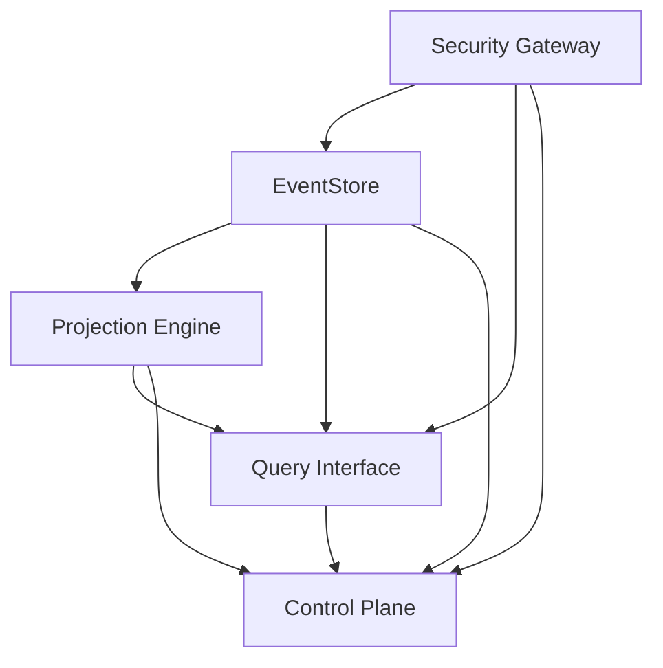

# ActorDB TypeScript Overview

## What Makes ActorDB Different?

ActorDB TypeScript is a complete event-sourcing database implementation that combines:

- **Event Sourcing**: All state changes stored as immutable events
- **CQRS**: Separate read and write models for optimal performance
- **Process Network Architecture**: Components orchestrated via topological ordering
- **Merkle DAG**: Immutable component versioning and dependency tracking

## Core Concepts

### Event Sourcing

```typescript
interface Event {
  aggregateId: string;
  sequence: number;
  eventType: string;
  data: Buffer;
  timestamp: Date;
  eventTime: Date;
  aggregateType: string;
  metadata?: { [key: string]: any };
}

// Writing events
const event: Event = {
  aggregateId: 'user-123',
  sequence: 1,
  eventType: 'user_created',
  data: Buffer.from(JSON.stringify({
    name: 'John Doe',
    email: 'john@example.com'
  })),
  timestamp: new Date(),
  eventTime: new Date(),
  aggregateType: 'User'
};

await eventstore.writeEvent(event);
```

### Actor-Based Persistence

Each aggregate (business entity) is an "actor" with single-writer semantics:

```typescript
class UserAggregate {
  private events: Event[] = [];

  constructor(private aggregateId: string) {}

  async createUser(name: string, email: string) {
    const event: Event = {
      aggregateId: this.aggregateId,
      sequence: this.events.length + 1,
      eventType: 'user_created',
      data: Buffer.from(JSON.stringify({ name, email })),
      timestamp: new Date(),
      eventTime: new Date(),
      aggregateType: 'User'
    };

    await eventstore.writeEvent(event);
    this.events.push(event);
  }
}
```

### Incremental View Maintenance (IVM)

Projections automatically maintain derived data:

```typescript
const userProjection: ProjectionDefinition = {
  name: 'user_summary',
  sources: [{ stream: 'user_created' }, { stream: 'user_updated' }],
  ivm: {
    lateWindowMs: 1000,
    watermarkLagMs: 500,
    delta: [
      {
        on: 'user_created',
        update: 'state[user_id] = { name: event.name, email: event.email }'
      },
      {
        on: 'user_updated',
        update: 'state[user_id] = { ...state[user_id], ...event.updates }'
      }
    ]
  }
};
```

## Process Network Topology

### Execution Order

Components start in strict topological order:

1. **Security Gateway** (`security_gateway`)
   - Validates tokens and permissions
   - Merkle DAG: `sha256:sec_gw_v1`

2. **EventStore** (`write_aggregate`)
   - Persists events with single-writer guarantees
   - Merkle DAG: `sha256:event_store_v1`

3. **Projection Engine** (`projection_engine`)
   - Maintains materialized views via IVM
   - Merkle DAG: `sha256:proj_eng_v1`

4. **Query Interface** (`query_interface`)
   - Provides REST API for queries
   - Merkle DAG: `sha256:query_if_v1`

5. **Control Plane** (`control_plane`)
   - Monitors and scales the system
   - Merkle DAG: `sha256:ctrl_pln_v1`

### Dependency Graph



## Merkle DAG Structure

Each component includes Merkle hash references for:

- **Version Control**: Immutable component versions
- **Dependency Tracking**: Input/output relationships
- **SLO Guarantees**: Performance commitments
- **Security Policies**: Access control definitions

```json
{
  "id": "security_gateway",
  "description": "Zero-trust messaging with mTLS + JWS + ABAC/RBAC",
  "dependencies": [],
  "outputs": ["validated_tokens", "audit_stream"],
  "security": "spiffe_shortlived_jwt",
  "slo": "token_validation_10ms",
  "merkle_hash": "sha256:sec_gw_v1"
}
```

## TypeScript Advantages

### Type Safety

```typescript
// Strongly typed events
interface UserCreatedEvent {
  aggregateId: string;
  sequence: number;
  eventType: 'user_created';
  data: {
    name: string;
    email: string;
  };
  timestamp: Date;
}

// Type-safe storage interfaces
interface Storage {
  writeEvent(event: Event): Promise<void>;
  readEvents(aggregateId: string, fromSeq: number): Promise<Event[]>;
}
```

### Modern JavaScript Features

```typescript
// Async/await for clean asynchronous code
async function processUserCreation(userData: UserData) {
  const event = createUserCreatedEvent(userData);
  await eventstore.writeEvent(event);
  await notifyProjectionEngine(event);
}

// ES modules for better organization
import { EventStore } from './eventstore';
import { SecurityGateway } from './security';
import type { Event, ProjectionDefinition } from './types';
```

### Developer Experience

- **IntelliSense**: Auto-completion for all APIs
- **Refactoring**: Safe code changes with type checking
- **Testing**: Type-safe mocks and test utilities
- **Documentation**: Self-documenting APIs via TypeScript

## Performance Characteristics

### SLO Guarantees

- **Write Path**: P99 latency < 100ms
- **Read Path (Materialized)**: P99 latency < 50ms
- **Read Path (On-demand)**: P99 latency < 200ms
- **Security Validation**: < 10ms
- **Auto-scaling Decision**: < 1s

### Scaling Strategies

- **Horizontal Scaling**: Projection engine workers
- **Vertical Scaling**: Memory and CPU allocation
- **Storage Scaling**: Multiple backend support
- **Load Balancing**: Query interface distribution

## Next Steps

- [Installation Guide](/getting-started/installation)
- [Quick Start Tutorial](/getting-started/quick-start)
- [Architecture Deep Dive](/architecture/process-network)
